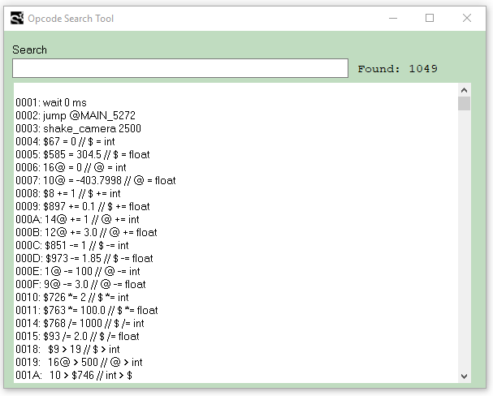

# Opcode Search Tool

You can call this tool by pressing `Ctrl+Alt+2` or by selecting the menu item: `Tools->IDE Tools->Opcode Search`.



To find an opcode, type some words in the input line, e.g. `actor car`. The tool displays the opcodes with these words. You can also use special search operators.

When the tool is open, it checks if there is a selected word in the editor. If the selected word is found, it will be copied into the search field.

## Copying Results

To copy an opcode into clipboard, select it in the list and press `Enter`. \
To add another opcode to the clipboard content press `Shift+Enter`. \
To copy the entire results list press `F2`.

## Hotkeys

`Enter` copy selected opcode onto clipboard\
`Shift+Enter` add selected opcode to the clipboard\
`F1` - show help information\
`F2` - copy all opcodes from the results list into clipboard\
`F3` - sort the list by opcodes\
`F4` - sort the list alphabetically\
`F11` - clear the search field, display all opcodes\
`ESC` - close the tool window

## Search Queries

### AND operator

A single space between words serves as the `AND` operator:

```
@ player
```

Finds all opcodes with both `@` and the word `player`.

### OR operator

The pipe character `|` is the `OR` operator:

```
@ | player
```

Finds all opcodes with either `@` or `player`.

If you write `|` as the first character in the search, the tool will connect all the following words with the OR operator.

```
| actor player car
```

Finds opcodes with either `actor`, `player` or `car`.

### NOT operator

Two dashes before the word exclude opcodes with this word from the result:

```
car --actor
```

Finds opcodes with `car` but without `actor`.

A single dash can be used before identifiers or `$` and `@` characters, but not numbers:

```
-10 -@ -car ---1
```

Finds opcodes with the number `-10` and without `@`, `car` and `-1`

### Search in conditional opcodes 

`^` - shows only conditional opcodes \
`^word` - finds `word` in the conditional opcodes:

```
^car ==
```

Finds all conditional opcodes with `car` and `==`.

`-^` - excludes all conditional opcodes from the list:

```
player -^
```

Finds all non-conditional opcodes with `player`.

`-^word` - excludes the conditional opcodes with `word`:

```
player -^actor
```

Finds opcodes with `player`, with the exception of the conditional opcodes with `actor`.

### Respect the order of the words

`%` - finds opcodes with the words in the given order:

```
% @ = @
```

Finds opcodes where `@` `=` `@` follow each other (possibly with other words in between).
